# KNN

## Описание проекта

В этом проекте демонстируется реализация алгоритма K-ближайших соседей с нуля и оценивается его производительность.

## Постановка проблемы

Цель проекта - решить задачу классификации с учителем с использованием алгоритма KNN и оценить его производительность.

Ключевые вопросы:

- Насколько хорошо алгоритм работает со структурированными данными?
- Насколько чувствительна модель к выбору гиперпараметров?
- Как KNN соотносится с другими моделями классификаций?

## Датасет

- Датасет: Iris
- Тип: классификация
- Признаки: числовые
- Цель: набор классов

## Описание алгоритма
К-ближайших соседей (K-Nearest Neighbors или просто KNN) — алгоритм классификации и регрессии, основанный на гипотезе компактности, которая предполагает, что расположенные близко друг к другу объекты в пространстве признаков имеют схожие значения целевой переменной или принадлежат к одному классу.

## Задача
В работе решается задача кластеризации Ирисов с четырьмя признаками и включает в себя этапы:

1) Выявление трех информативных признаков.
2) Разделение выборки.
3) Обучение модели.
4) Оценка качества.
5) Сравнение результатов с моделью, определенной в библиотеке **sklearn**.

Затем дополнительно рассматривается вопрос снижения размерности данных с помощь *PCA* и сравниваются полученные результаты.

---

Принцип работы KNN
Алгоритм строится следующим образом:

1) Сначала вычисляется расстояние между тестовым и всеми обучающими образцами.
2) Далее из них выбирается k-ближайших образцов (соседей), где число k задаётся заранее.
3) Итоговым прогнозом среди выбранных k-ближайших образцов будет мода в случае классификации и среднее арифметическое в случае регрессии.
4) Предыдущие шаги повторяются для всех тестовых образцов.

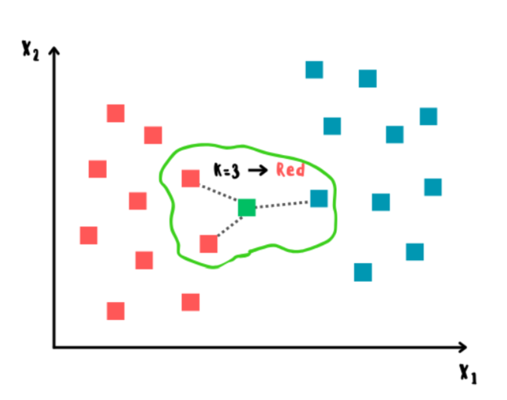

*Рис. 1 - Визуализация алгоритма*

Существует множество метрик для вычисления расстояния между объектами, среди которых наиболее популярными являются следующие:

- Евклидово расстояние — это наиболее простая и общепринятая метрика, которая определяется как длина отрезка между двумя объектами a и b в пространстве с n признаками.

- Манхэттенское расстояние — метрика, которая определяется как сумма модулей разностей координат двух точек в пространстве между двумя объектами a и b с n признаками

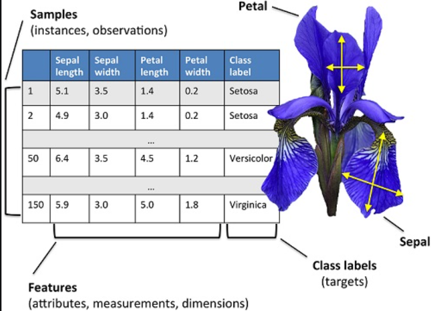

*Рис. 2 - используемый датасет*

---

Начнем изучение датасета с рассмотрения распределения признаков внутри каждого класса:

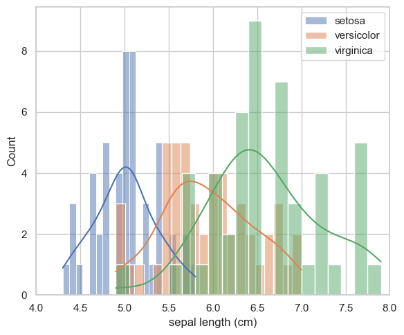 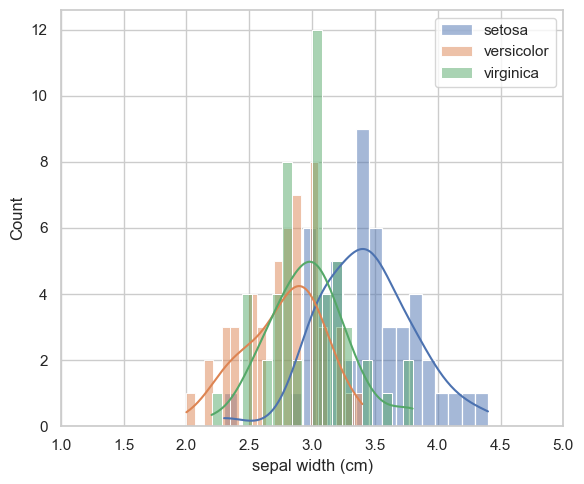

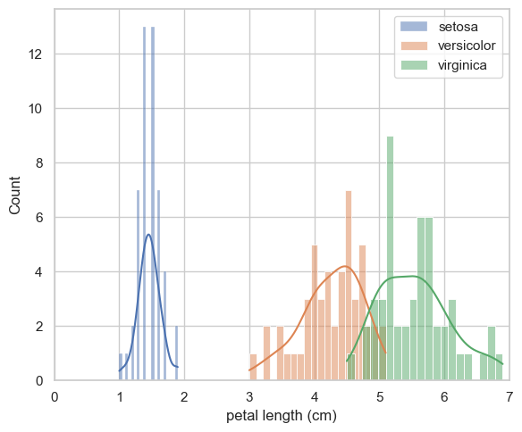 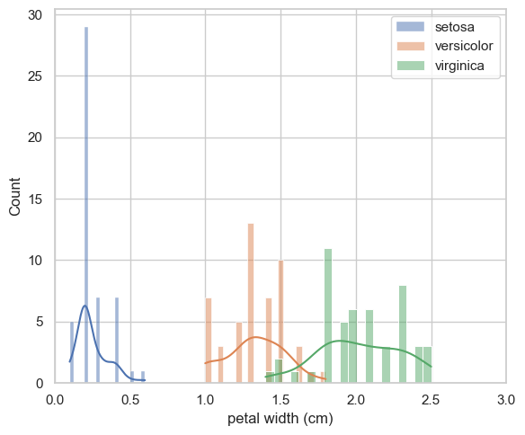

*Рис. 3 - распределение признаков*

Так как значение ширины чашелистников расположены близко друг другу для классов, то этот параметр не стоит использовать (т.к. по этому параметру классы трудно отличить друг от друга).

Построим так же кореляционную карту для определения зависимости между признаками:

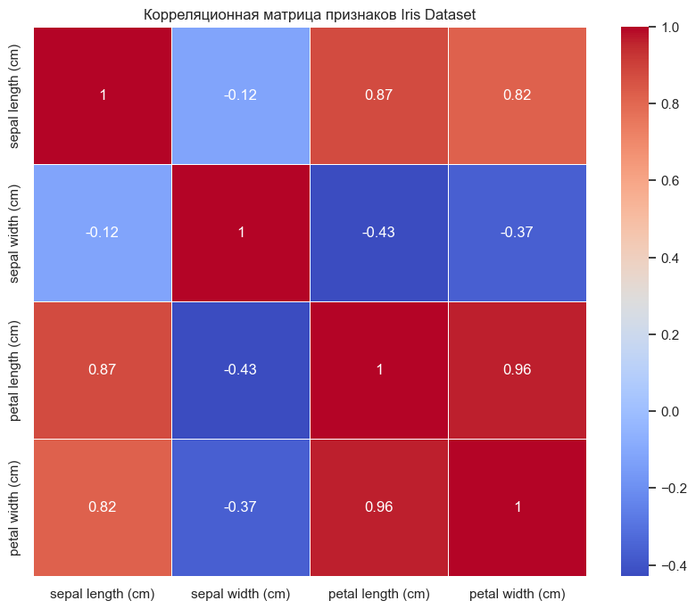

*Рис. 4 - тепловая карта*

Здесь чем ближе значение к 1, тем больше признаки кореллируют друг с другом и, соответственно, сохраняют больше информации об исходном распределении. Видно, что ширина чашелистника плохо корелирует с другими признаками, поэтому его не стоит использовать.

---

Проведем оценку для поиска наилучшего набора параметров модели: (норма, соседи). Сначала сравним наилучшее количество соседей при фиксированной норме (Евклидова):

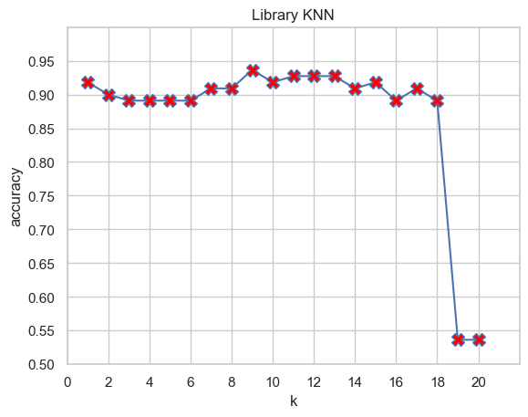 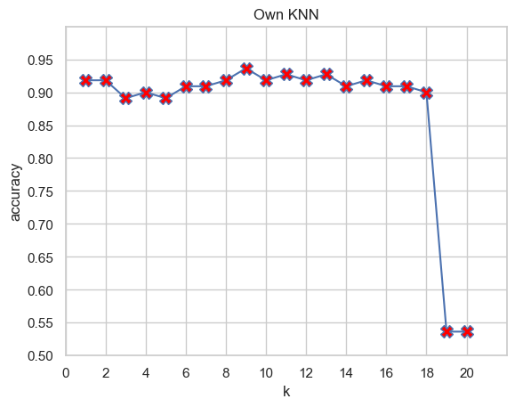

*Рис. 5 - зависимость точности от количества соседей*

Алгоритм из данной работы практически полностью совпал с реализацией библиотечной функции. Наибольшая точность наблюдается при `k = 9`.

Теперь выполним сравнение метрик:

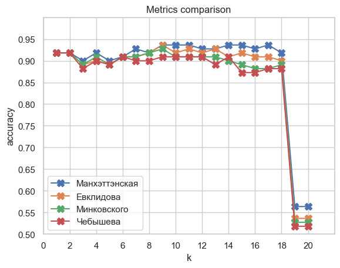

*Рис. 6 - сравнение метрик*

Из графика видно, что Евклидова норма хоть и является наиболее распространенной, но в данном примере почти на всех значениях *k* Манхэттэнская норма показывает себя лучше.

Рассмотрим еще одну метрику - матрица путанницы:

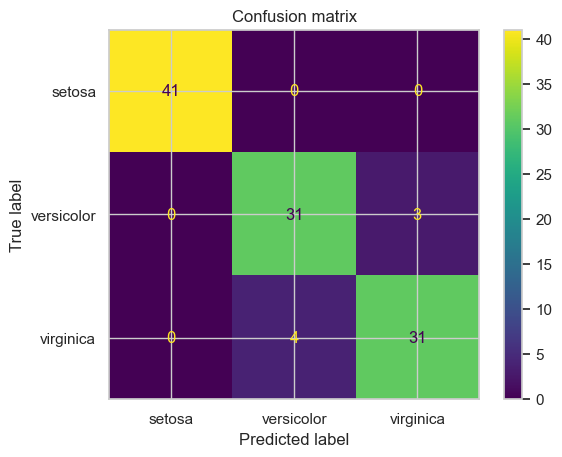

*Рис. 7 - confusion matrix*

Матрица показывает, что модель идеально определила класс *setosa*, но несколько раз перепутала *versicolor* и *virginica*. Это связано с тем, что признаки этих классов накладываются друг на друга и из-за этого их трудно классифицировать.

### Дополнительное снижение размерности

Интерес также представляет то, как снижение размерности входных данных влияет на качество модели. Для примера будем использовать *метод главных компонент* (PCA). Будем снижать размерность с 3 признаков до 2. Получаем следующее распределение:

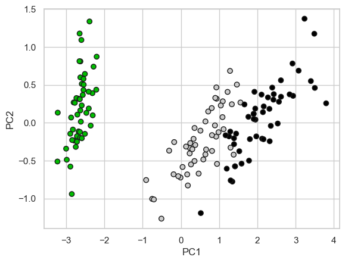

*Рис. 8 - распределение сжатых данных*

Здесь явно видно разделение трех признаков на области, хотя две из них находятся близко друг другу и даже пересекаются, что плохо скажется на качестве обучения.

В результате применения KNN к сжатым данных получили:

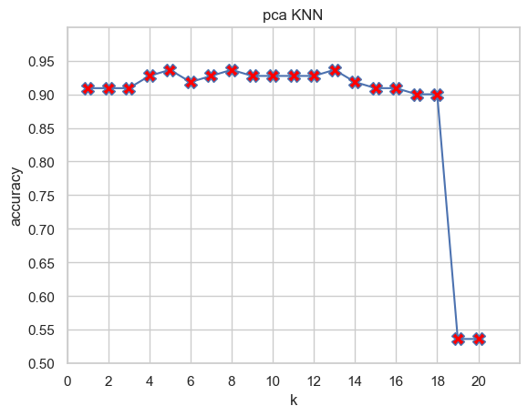

*Рис. 9 - точность классификации сжатых данных*

Отсюда видно, что точность практически не изменилась, следовательно PCA может применяться в алгоритме KNN для уменьшения объема данных. Более строго, сравнительная оценка: MAE $\approx$ 0.015. Это свидетельствует о том, что удалось сохранить практически всю информацию об исходном распределении данных.

## Сравнение с другими моделями

Сравним модель KNN с моделями логистической регрессии и случайным деревом:

- KNN: accuracy $\approx$ 0.936,
- Логистическая регрессия: accuracy $\approx$ 0.9,
- Случайное дерево: accuracy $\approx$ 0.927.

## Выводы

Метод K-ближайших соседей является одним из способов решения задачи классификации. Он обладает как преимуществами, так и недостатками. При его использовании важно подбирать правильные значения параметров *k* и *norm*, которые сильно влияют на качество обученной модели. Кроме того предварительно требуется выделять информативные признаки данных.

Для рассматриваемого примера датасета Ирисов было показано, что наилучшими параметрами модели является пара (k, norm) = (9, "Манхэттэнская"), а информативным набором является тройка ("Длина чашелистника", "Длина лепестка", "Ширина лепестка").

Примененный в последствии механизм PCA позволил снизить объем информативных признаков на 30% и при этом точность снизилась почти никак.